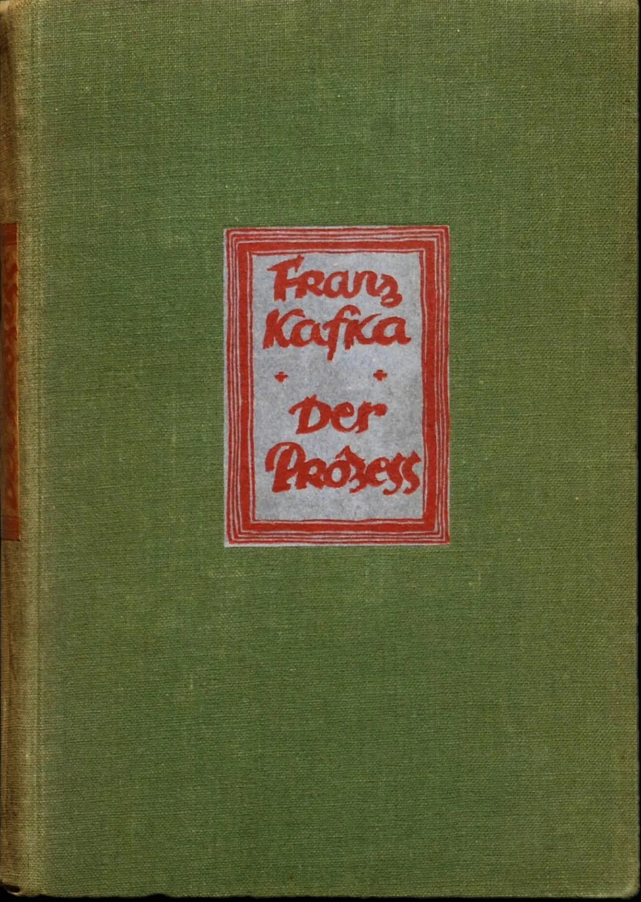
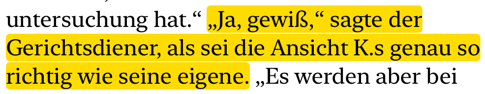

# Der Prozeß

by Franz Kafka

## 13 April 2025

## 16 März 2025

« K. sah sie ausdruckslos, wie eine Fremde an, er wollte weder verraten, daß er enttäuscht war, noch auch, daß er die Enttäuschung leicht überwinden könne. »

x x x

Impulsive ——

« "Dann mag er laufen und Sie will ich nie mehr sehn," sagte K. wütend vor Enttäuschung »

## 3 March 2025

« Schließlich stieg er doch die erste Treppe hinauf und spielte in Gedanken mit einer Erinnerung an den Ausspruch des Wächters Willem, daß das Gericht von der Schuld angezogen werde, woraus eigentlich folgte, daß das Untersuchungszimmer an der Treppe liegen mußte, die K. zufällig wählte. »

## 2 March 2025

« Es ist so," sagte K. und nun sahen einander beide zum erstenmal in die Augen, „die Art und Weise, in der es geschah, ist an sich keines Wortes wert." „Aber doch das eigentlich Interessante," sagte Fräulein Bürstner. »

## 1 March 2025

« Einleitungen überhöre ich immer," sagte Fräulein Bürstner. »
« Es war ½12 vorüber, »

x x x

« …aber diese Verhaftung - . Es kommt mir wie etwas Gelehrtes vor, entschuldigen Sie, wenn ich etwas Dummes sage, es kommt mir wie etwas Gelehrtes vor, das ich zwar nicht verstehe, das man aber auch nicht verstehen muß. »

## 28 February 2025

« In diesem Frühjahr pflegte K. die Abende in der Weise zu verbringen, daß er nach der Arbeit, wenn dies noch möglich war - er saß meistens bis 9 Uhr im Bureau - einen kleinen Spaziergang allein oder mit Beamten machte und dann in eine Bierstube ging, wo er an einem Stammtisch mit meist ältern Herren gewöhnlich bis 11 Uhr beisammen saß. Es gab aber auch Ausnahmen von dieser Einteilung, wenn K. z. B. vom Bankdirektor, der seine Arbeitskraft und Vertrauenswürdigkeit sehr schätzte, zu einer Autofahrt oder zu einem Abendessen in seiner Villa eingeladen wurde. Außerdem ging K. einmal in der Woche zu einem Mädchen namens Elsa, die während der Nacht bis in den späten Morgen als Kellnerin in einer Weinstube bediente und während des Tages nur vom Bett aus Besuche empfing. »

x x x

« Es wunderte K., wenigstens aus dem Gedankengang der Wächter wunderte es ihn, daß sie ihn in das Zimmer getrieben und ihn hier allein gelassen hatten, wo er doch mehrfache Möglichkeit hatte, sich umzubringen. »

x x x

« in der Bank versäumte er zwar heute vormittag seinen Dienst, aber das war bei der verhältnismäßig hohen Stellung, die er dort einnahm, leicht entschuldigt. »

x x x

« Sie reden doch jedenfalls von Dingen, die sie gar nicht verstehn. Ihre Sicherheit ist nur durch ihre Dummheit möglich. »

x x x

« - wohl aber erinnerte er sich - ohne daß es sonst seine Gewohnheit gewesen wäre, aus Erfahrungen zu lernen - an einige an sich unbedeutende Fälle, in denen er zum Unterschied von seinen Freunden mit Bewußtsein, ohne das geringste Gefühl für die möglichen Folgen sich unvorsichtig benommen hatte und dafür durch das Ergebnis gestraft worden war. »

## 27 February 2025

« Es fiel ihm zwar gleich ein, daß er das nicht hätte laut sagen müssen und daß er dadurch gewissermaßen ein Beaufsichtigungsrecht des Fremden anerkannte… »

x x x

« … sagte K. und versuchte zunächst stillschweigend durch Aufmerksamkeit und Überlegung festzustellen, wer der Mann eigentlich war.»