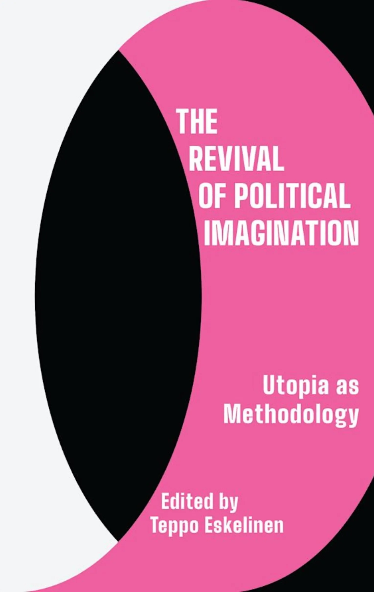

# The Revival of Political Imagination. Utopia as Methodology.

the-revival-of-political-imagination-utopia-as-methodology

Lotta wanted to have it for her birthday and the cultural appropriation thieving magpie I am - I ordered a copy for myself.

Published by the Harry Potter's publisher Bloomsbury.

## 15 April 2025

## previously

The book is written by a bunch of Finns. Gives it a Moomin feeling.

