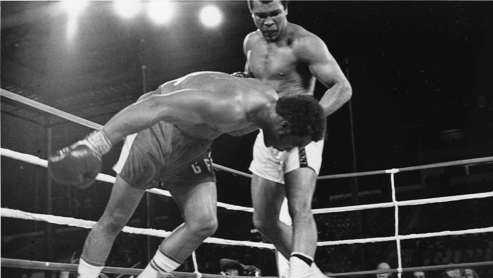

# My idols are dead and my enemies are in power."

The people whose deaths make me feel like my world is ending.

## George Foreman

There is an interview w/ Muhammad Ali, "Why did not you hit him one last time as he was in his final spin?"

## David Lynch

I will muss his wild hair.

And his incomprehensible films.

## Otto Schenk

"Er war ein Lausbub. Durch und durch ein schlimmes Kind."

Opening sentence in Traces to Nowhere, speaking about Carlos Kleiber.

## Maggie Smith

"What would you tell to your younger self?"

Maggie Smith, "I honestly don't know, because I would not be listening. But I would say, 'When in doubt, don't.'"

Tea with the Dames

Alan Bennett and Maggie Smith. "The Lady in the Van" is the film, that makes me think most fondly of her.She was quietly introvert and yet powerful.
In my teenage years I had one aunt, who once leaned back behind the person between us, during a family gathering, and told me, that my behaviour does not reflect my age. I remember growing up 5 years in a couple of seconds. It was like introducing an ice crystal to supercooled water. That's what Maggie Smith was for me.

## Alain Delon

Joined his brother.

I do not have any particular memories about him. They were the air we breathed when I was a child.

## Richard Lugner, 2024

To say I liked him would insult my intelligence. But I did like two things about him. That he was himself. And that he was himself v consequently over a v long period of time.

## Ryan O'Neal, 2023

Barry Lyndon influenced me in more ways than I can comprehend. During the times I wanted to become Vittorio Storaro, I admired Stanley Kubrick for filming Barry Lyndon by candlelight and making every scene look like a classical painting. And then the Sarabande, that touches me to the bone every time I hear it.

## Shane MacGowan, 2023

Shane gave me the confidence that beauty is on the inside.

What's Another Year

What A Wonderful World w/ Nick Cave

## Charles T. Munger, 2023

Charles T. Munger inspired me w/ his quiet ability to be №2.

"Envy is a really stupid sin, because it's the only one you could never possibly have any fun at."

NYT Obituary

## Jane Birkin, 2023

I have never seen women as sex symbols. What Jane Birkin gave me was the freedom to leave England, to learn French, to team up w/ someone like Serge Gainsbourg (another hero of mine) and to give birth to Charlotte Gainsbourg, who portrayed brilliantly in Lars von Trier's Melancholia and unbearably brilliant - I could not watch it - Antichrist.

She was also born in Marylebone, where is Ivor Place.

Jane B.

## Bernard Chabbert, 2022

Gave me a beautiful example of seeing a person in a completely different light by writing and narrating St Ex: Un prince dans sa citadelle.

## Jean-Paul Belmondo, 2021

One of the men, who deeply impressed me as a young boy.

## Ruth Bader Ginsburg, 2020

Opened my eyes (in shame): "Fight for the things that you care about, but do it in a way that will lead others to join you."

## Peter Lindbergh, 2019

Peter Lindbergh taught me, that the only thing I can give to the world is my authentic self. Something I had already began to suspect.

## Anthony Bourdain, 2018

Anthony Bourdain encouraged me to do what I love.

## John Hurt, 2017

A man should know when to leave the party.

What about Smiley?

Smiley is leaving with me.

## Umberto Eco, 2016

Gave me the confidence, that I can have "not a library at home, but a home in my library". And that "one does not need to have read all the books one owns".

## Susan Sontag, 2004

Susan Sontag encouraged my pursuit of intellectual brilliantness and gave me confidence, that the intellectual thought is the ultimate power that shapes us and our world.

## Kurt Vonnegut, 2007

Kurt Vonnegut taught me that to tell a very difficult story one should begin far away and possibly tell an entirely different story for most of the time.
He was my absent, intellectual father.

## Karlsson, 2002
Karlsson gave me confidence to be myself - a rebel - w/ a lightness of heart.

## Pippi Långstrump, 2002

Gave me confidence to be myself - a rebel - w/ lightness of heart.

## William S. Burroughs, 1997

William S. Burroughs gave me the confidence to live Oscar Wilde's words, "The only way to get rid of a temptation is to yield to it."

## Divine, 1988

Gave me confidence to be myself.

## Klaus Nomi, 1983

Klaus Nomi encouraged me to look for authenticity.

## Jack Kerouac, 1969

Jack Kerouac gave me the confidence that one can sit in front of a type writer and type for three weeks 120 feet long scroll w/ On The Road in one go. I have the 50th Anniversary Edition containing the original scroll which begins w/ a typo.

## Hermann Hesse, 1962

Herman Hesse gave me a of the German Language like no other.

## T. E. Lawrence, 1935

The confidence to be myself and place a distance between myself and the world.

## Adolf Loos, 1933

The confidence to be a rebel. He said, "It is easy to invent a new chair. It is difficult to invent a better chair." He also wrote a book called Ornament in Crime, in German, where all German nouns were written w/ a small 1st letter.

## Arthur Schnitzler, 1931

Feeling of one of the forms of ultimate sacrifice in Der Ruf des Lebens.