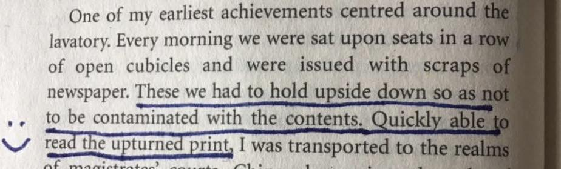

# Prohibition

What happens, when one prohibits things. Or as a wise person once remarked, "Prohibition is better, than no liqueur at all."

_From No Cake, No Jam by the grandmother of my good friend Charlie, the late Marian Hughes._