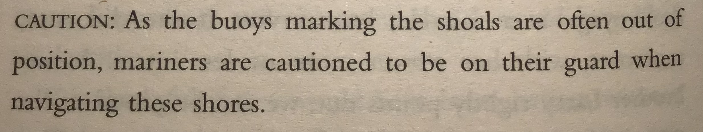

A collection of my intellectusl pursuits. I am merging several 1 000 topics from several medium.com sites, which I am about to close. s well as from my private Apple notes. It might take a while.

# Table of Contents

## Русский

## English

### Family

[Family Values](./Family/README.md)

### Philosophy

Paradox of Tolerance in [Tolerance](./Tolerance/README.md)

### Literature

[Paradise Lost](English/Literature/ParadiseLost/README.md)

[The Cocktail Party](English/Literature/the-cocktail-party/README.md) by T. S. Eliot

[The Revival of Political Imagination. Utopia as Methodology.](./English/Literature/the-revival-of-political-imagination-utopia-as-methodology/README.md) I did not think a book about politics will excited me at my age, like I am in my late teens.

### Review of the Press

[Review of the Press](ReviewofthePress/README.md)

### Human Nature

[Extrovert](Extrovert/README.md)

[Motivation and Importance](Motivation/README.md)

[Prohibition](Prohibition/README.md)

[Criticism and Critique](criticism-and-critique/README.md)

### Cinema

[Conclave](English/Cinema/Conclave/README.md), 5 April 2025. Good my way.

### Articles

#### 12 April 2025

[The Scots magician who inspired the great Houdini](./articles/the-scots-magician-who-inspired-the-great-houdini/)

### Laws

Kidlin's Law (no record of Kidlin) "If one writes a problem down in an understandable way, half of the problem is solved."

## Deutsch

### Literatur

[Also sprach Zarathustra](Deutsch/Literatur/AlsosprachZarathustra/README.md)

[Der Prozeß](Deutsch/Literatur/DerProzeß/README.md)

[Woyzeck](Deutsch/Literatur/Woyzeck/README.md)

### Rechtswissenschaft

[Rechtswissenschaft](Rechtswissenschaft/README.md)

## Français

### Cinéma

[La rebelle, les aventures de la jeune George Sand](./Français/Cinéma/LaRebelle/README.md)

[Les Femmes au Balcon](./Français/Cinéma/les-femmes-au-balcon/README.md)

[Le Testament d'Orphée](./Français/Cinéma/le-testament-d'orphée/README.md)

Madame Bovary

### Livres

[Surveiller et punir](./Français/livres/surveiller-et-punir/README.md) de [Michel Foucault](./People/michel-foucault/README.md)

[Madame Bovary](./Français/livres/madame-bovary/README.md)

### Revues

[SIC](./Français/revues/sic/README.md)

### Les gens

[Marcel Duchamp](./People/marcel-duchamp/README.md)

[Raymond Radiguet](./People/raymond-radiguet/README.md)

## Music

Claude Debussy 2 Arabesques, CD 74: No. 1 in E Major. Andantino con moto -- [https://youtu.be/nId-f-_pKbQ](https://youtu.be/nId-f-_pKbQ)

[Mr. Blue Sky](./music/mr-blue-sky/README.md)

[Them Bones](./music/them-bones/README.md) by Alice in Chains

[White Rabbit](./music/white-rabbit/README.md) by Jefferson Airplane

## Computing

[Agile. My Way.](Computing/AgileMyWay/README.md)

## People

[A very high profile people using popular quotes](./Quotes/README.md)

[My Idols are Dead and my Enempies are in Power](People/MyIdolsareDeadandmyEnemiesareinPower/README.md)

x x x

[Anthony Bourdain](People/AnthonyBourdain/README.md)

[Friedrich Nietzsche](People/FriedrichNietzsche/README.md)

[Herbert von Karajan](People/HerbertvonKarajan/README.md)

[Jean Cocteau](./People/jean-cocteau/README.md)

[Leonard Bernstein](People/LeonardBernstein/README.md)

Louise Bourgeois

# Have a question or need help?

I help gladly.

Email me at t.e.shaw@dahoum.wales.
