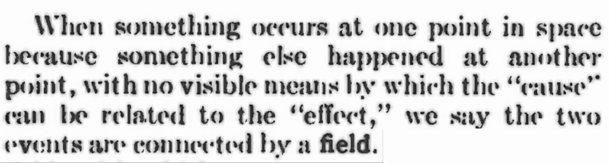
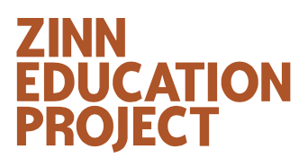

Amateurs. Chaplin.

The 37th Edition of The Radio Amateur's Handbook, 1960.

# Timeline

[21 May 2025](./timeline/2025/01/21/README.md)

# Notes

## Русский

### Книги

[Мартиролог](./русский/книги/мартиролог/README.md)

[Пикник на обочине](./русский/книги/пикник-на-обочине/README.md) `27 апрель 2025-`

## Фильм

[Сталкер](русский/фильмы/сталкер/README.md)

### Люди

[Андре́й Тарко́вский](./русский/люди/андрей-тарковский/README.md)

[Братья Стругацкие](русский/люди/братья-стругацкие/README.md)

## English

### Original Research

[Authenticity] Peter Lindberf, "you have nothing to give but your authenticity ", able heart "real is what goes viral" https://www.facebook.com/reel/568984926250146?fs=e&fs=e 

[The Revolution Will Not Be Televised]

[Reading](./english/original-research/reading/README.md)

[Renewable Energy](./english/renewable-energy/README.md)

[https://en.wikipedia.org/wiki/List_of_peace_activists](https://en.wikipedia.org/wiki/List_of_peace_activists)

### Original Thought

[Family Values](./Family/README.md)

[1-(1-1-1)-1](./english/original-thought/1-1-1-1-1/README.md)

[How I became the Mother of Durrell or Why and How I bought a horse] `2024-`

People Reading in Public

[Famous People as Young Adults](./english/original-thought/famous-people-as-young-adults/README.md)

[(working title) Empathy as an Ingredient of Expertise](./english/original-thought/empathy-as-an-ingredient-of-expertise/README.md)

[How to Save the World](./english/original-thought/how-to-save-the-world/README.md)

[The Morale of the Artists](./english/original-thought/the-morale-of-the-artists/README.md)

[Diplomacy] / https://www.facebook.com/share/v/1B8KNsHToG/

### Philosophy

Paradox of Tolerance in [Tolerance](./Tolerance/README.md)

### Literature

I remember, as a child, my grandmother had bonbons, that were covered w/ their own dust. I liked to keep them in my mouth till the dust had melted and then I would place them on another tray. Once I had licked the dust out of all bonbons.

I think this defines part of my attitude towards books, for it is impossible to read all the good books, but I try to at least get their essense, the feel. Someone once said, that "some people write a book to help other people write one sentence". I think one can enjoy some books simply by having them, by holding them, by reading the dust jacket and a few pages.

[A Theory of Semiotics](./english/literature/a-theory-of-semiotics/README.md) by Umberto Eco

[Paradise Lost](english/literature/ParadiseLost/README.md)

[The Cocktail Party](english/literature/the-cocktail-party/README.md) by T. S. Eliot

[The Revival of Political Imagination. Utopia as Methodology.](./english/literature/the-revival-of-political-imagination-utopia-as-methodology/README.md) I did not think a book about politics will excited me at my age, like I am in my late teens.

[Time Within Time: The Diaries 1970–1986](./english/literature/time-within-time-the-diaries-1970-1986/README.md) by [Andrei Tarkovsky](./people/andrei-tarkovsky/README.md)

Silverview by John le Carré (I am Edward Avon)

The Rings of Saturn by W. G. Sebald (learned about it from Edward Avon from Silverview)

[The Big Short](./english/literature/the-big-short/README.md)

[Cavett](./english/literature/cavett/README.md) by Dick Cavett and Christopher Porterfield `27 April 2025-`

[Eye on Cavett] While researching Christopher Porterfield in relation to [Cavett](./english/literature/cavett/README.md) `30 April 2025-`

[A Wizard of Earthsea](./english/literature/a-wizard-of-earthsea/README.md) by [Ursula Le Guin](./english/people/ursula-le-guin/README.md) The formative book of a good friend in his late teens and early 20s.

[The Handmaid's Tale] MA on recommendation by AEE I first refused due to hype then discovered its 300 pages and how did they make so many episodes? `1 May 2025` image in the desert eat stones ///

Everybody's Protest Novel by James Baldwin in relation to Uncle Tom's Cabin `18 May 2025`

The Big Short `25 May 2025`

?, for rhetorical questions (on BBC4, unspeakable)

[The Bell Jar](./english/literature/the-bell-jar)

### Review of the Press

[Review of the Press](./review-of-the-press/README.md)

### Human Nature

[Extrovert](Extrovert/README.md)

[Motivation and Importance](Motivation/README.md)

[Prohibition](Prohibition/README.md)

[Criticism and Critique](criticism-and-critique/README.md)

[Creativity](./Creativity/README.md) Paul McCartney and John Cleese

[Friendship](friendship/README.md) Why is it more difficult to make friends as an adult?

Change / Change before you have to / when you change (that image) /

be useful | Arnold Schwarzernegger, his autobiography. [Elia Kazan](./people/elia-kazan/README.md, read the obituary.

### Paradoxes

Bonini's paradox "As a model of a complex system becomes more complete, it becomes less understandable. Alternatively, as a model grows more realistic, it also becomes just as difficult to understand as the real-world processes it represents." [https://en.wikipedia.org/wiki/Bonini%27s_paradox](https://en.wikipedia.org/wiki/Bonini%27s_paradox)

### People

[Foreigners](./english/people/foreigners)

[A very high profile people using popular quotes](./Quotes/README.md)

[My Idols are Dead and my Enempies are in Power](people/MyIdolsareDeadandmyEnemiesareinPower/README.md)

[Extraordinary people have ordinary problems](./people/extraordinary-people-have-ordinary-problems/README.md)

#### x x x

[Andrei Tarkovsky](./people/andrei-tarkovsky/README.md)

[Anthony Bourdain](people/AnthonyBourdain/README.md)

[Leonard Bernstein](people/LeonardBernstein/README.md)

[D. E. Shaw](./english/people/d-e-shaw/README.md)

[Sylvia Plath](./english/people/sylvia-plath/README.md) [The Bell Jar](./english/literature/the-bell-jar/README.md) [https://en.wikipedia.org/wiki/Dame_Edna_Everage])https://en.wikipedia.org/wiki/Dame_Edna_Everage)

[Dick Cavett](./english/people/dick-cavett/README.md) reading Cavett `3 May 2025`

[Ursula Le Guin](./english/people/ursula-le-guin/README.md) `30 April 2025`

[Caoimhe Butterly](https://en.wikipedia.org/wiki/Caoimhe_Butterly) `8 June 2025`

Louise Bourgeois

[Dame Edna] w/ Trump [https://www.facebook.com/reel/137556588406027?fs=e&fs=e](https://www.facebook.com/reel/137556588406027?fs=e&fs=e) 

Huxley https://www.facebook.com/reel/1942626972759778?fs=e&fs=e 

[Stuart Nolan](./english/people/stuart-nolan/README.md) re: PhD `3 May 2025`

[Casanova] https://www.bbc.com/reel/video/p0lb6x9t/inside-the-hidden-quarters-of-history-s-greatest-seducer https://it.wikipedia.org/wiki/Lia_Celi The G Variations Prague

Wes Anderson

[Elia Kazan](./people/elia-kazan/README.md) I grew up hearing and reading the name Elia Kazan.

[Andy Warhol](./english/people/andy-warhol/README.md)

[Igor Stravinsky](./english/people/igor-stravinsky/README.md)

[Emily Bender]

[Jackson Pollock] "Each age finds its own technique." https://youtu.be/PYpA0iWhjJc 

[George Bernard Shaw](./english/people/george-bernard-shaw)

### Cinema

[Conclave](english/cinema/conclave/README.md), 5 April 2025. Good my way.

[The Big Short](./english/cinema/the-big-short/README.md)

[Margin Call](./english/cinema/margin-call/README.md)

The Grand Budapest Hotel

[One Flew Over the Cuckoo's Nest](english/cinema/one-flew-over-the-cuckoos-nest/README.md)

[Requiem for a Dream](./english/cinema/requiem-for-a-dream/README.md) `7 June 2025` 

[Something the Lord Made](./english/cinema/something-the-lord-made) w/ Mos Def and Alan Rickman

The Spy Who Came In From The Cold https://youtu.be/F8MwYkbvJjI also place at JlC

### Papers and Magazines

### Articles

#### 12 April 2025

[The Scots magician who inspired the great Houdini](./english/articles/the-scots-magician-who-inspired-the-great-houdini/)

### Laws

Kidlin's Law (no record of Kidlin) "If one writes a problem down in an understandable way, half of the problem is solved."

### Civil Rights

### Theatre

[Jeffrey Bernard is Unwell] (1990) Peter O'Toole https://youtu.be/g6cYbZe1WYU "One day I was asked to write my autobiography and I put a letter in the Spectator asking if anyone could tell me what I was doing between 1960 and 1974."

[Hamlet](./english/theatre/hamlet)

## Deutsch

### Gedanken

"In einer Demokratie zu leben, ist kompliziert. Ich habe bemerkt, dass Menschen, die aus einem autokratischen System in eine Demokratie kommen, eine leichte Neigung haben, die Ideen, die sie selbst gut finden, in der Demokratie mit einer etwas autoritären Haltung zu kommunizieren, als ob das der einzige Weg sei und es jetzt geschehen müsse. Wenn man den demokratischen Diskurs bewahren möchte, geht das, meiner Meinung nach, nicht." `7 Juni 2025`

### Personen

[Friedrich Nietzsche](people/FriedrichNietzsche/README.md)

[Herbert von Karajan](people/HerbertvonKarajan/README.md)

[Elfride Jelinek](deutsch/leute/elfride-jelinek/README.md)

[Ferdinand Raimund]

[Johann Nestroy]

### Literatur

[https://de.wikipedia.org/wiki/Kleinschreibung](https://de.wikipedia.org/wiki/Kleinschreibung) Adolf Loos, Elfride Jelinek

### x x x

[Also sprach Zarathustra](deutsch/literatur/AlsosprachZarathustra/README.md)

[Der Prozeß](deutsch/literatur/DerProzeß/README.md)

[Woyzeck](deutsch/literatur/Woyzeck/README.md)

[Das Lachen der Ungetäuschten](./deutsch/literatur/das-lachen-der-ungetäuschten/README.md)

[Burgtheater](./deutsch/literatur/burgtheater/README.md)

### Rechtswissenschaft

[Rechtswissenschaft](Rechtswissenschaft/README.md)

### Gesellschaft

Historikerstreit / Ernst Nolte / Der Faschismus in seiner Epoche / see Review of the Press of 4 May 2025

### Zeitschriften

https://brotundspielezeitschrift.at via Claudia fb

### Austtellungen

[Jugendstil](./deutsch/ausstellungen/jugendstill-kunsthalle-muenchen/README.md)

### Organisationen der Zivilgesellschaft

### Radioprogramme

[Die Peter Thiel Story](https://www.deutschlandfunk.de/die-peter-thiel-story-100.html) `3 July 2025`

[Die Elon Musk Story](https://www.ardaudiothek.de/sendung/1live-die-elon-musk-story/urn:ard:show:54d819d5fb6a8835/)

## Français

### Cinéma

https://www.canalplus.com/cinema/

https://boutique.arte.tv

#### x x x

[La rebelle, les aventures de la jeune George Sand](./français/Cinéma/LaRebelle/README.md)

[Les Femmes au Balcon](./français/Cinéma/les-femmes-au-balcon/README.md)

[Le Testament d'Orphée](./français/Cinéma/le-testament-d'orphée/README.md)

[Madame Bovary](./français/Cinéma/madame-bovary/README.md) en français 

[Le Blé en herbe] `27 April 2025`

### Livres

For a fine vocabulary, read 137 books

https://en.wikipedia.org/wiki/French_literature#French_Nobel_Prize_in_Literature_winners 

https://en.wikipedia.org/wiki/French_literature#French_literary_awards 

https://en.wikipedia.org/wiki/French_literature#Key_texts 

https://fr.wikipedia.org/wiki/Littérature_française 

1 Les Trois Mousquetaires ... audio+epub

2 Le Comte de Monte-Cristo 28 July 2024-9 March 2025 audio only

3 La Comtesse d'Escarbagnas 17 February 2025 audio only 

4 Laura. Voyages et Impressions (1865) 9 March 2025-... audio 

5 [Le Blé en herbe](./français/livres/le-ble-en-herbe/README.md) `26 April 2025`

[Surveiller et punir](./français/livres/surveiller-et-punir/README.md) de [Michel Foucault](./people/michel-foucault/README.md)

[Madame Bovary](./français/livres/madame-bovary/README.md)

### Journaux et Magazines

### Revues

[SIC](./français/revues/sic/README.md)

### Les gens

[Marcel Duchamp](./people/marcel-duchamp/README.md)

[Raymond Radiguet](./people/raymond-radiguet/README.md)

[Jean Cocteau](./français/les-gens/jean-cocteau/README.md)

[Colette](./français/les-gens/colette/README.md)

[Gustave Flaubert] [Madame Bovary](./français/livres/madame-bovary/README.md)

### Maisons d'édition

J'ai lu [https://fr.wikipedia.org/wiki/J'ai_lu](https://fr.wikipedia.org/wiki/J'ai_lu) [Le Blé en herbe](./français/livres/le-ble-en-herbe/README.md)

## Music

Claude Debussy 2 Arabesques, CD 74: No. 1 in E Major. Andantino con moto -- [https://youtu.be/nId-f-_pKbQ](https://youtu.be/nId-f-_pKbQ)

[Mr. Blue Sky](./music/mr-blue-sky/README.md)

[Them Bones](./music/them-bones/README.md) by Alice in Chains

[White Rabbit](./music/white-rabbit/README.md) by Jefferson Airplane

Señorita [https://youtu.be/Pkh8UtuejGw](https://youtu.be/Pkh8UtuejGw)

[The Cold Song](./music/the-cold-song/README.md) Best performances and Special Mentions.

[Lithium](music/lithium/README.md)

Frankie Goes to Holywood [https://www.facebook.com/reel/504841162596866?fs=e&fs=e](https://www.facebook.com/reel/504841162596866?fs=e&fs=e) [https://youtu.be/Yem_iEHiyJ0](https://youtu.be/Yem_iEHiyJ0)

https://youtube.com/shorts/9NXq2tpvAcE?si=Qn6rgRBgSb3XQOTt 

https://youtube.com/shorts/luQxPMOaRu4?si=c7j8h5SWbpVQTX1W

https://youtube.com/shorts/spzJXy69LCI?si=l15RhGerRRq5JjoK

https://youtube.com/shorts/x2ryfMgQmOE?si=Kxv-S5jMs95jKEd_

https://youtube.com/shorts/OBgMCC-DkpU?si=prrKt0O9zZ42v-YV

Tattoo Loreen https://youtube.com/shorts/fTJ0qt80LiQ?si=7J9XOU518dUxJWKm 

Adele Rolling in the Deep [https://youtu.be/rYEDA3JcQqw](https://youtu.be/rYEDA3JcQqw)

### Music Theory

https://youtube.com/shorts/vip4VfvbgMw?si=zgeFdTwAE5p6bst1

### Take me back to the 80s

Voyage, Voyage

## Computing

[Agile. My Way.](Computing/AgileMyWay/README.md)

# Have a question or need help?

I help gladly.

Email me at t.e.shaw@dahoum.wales.
