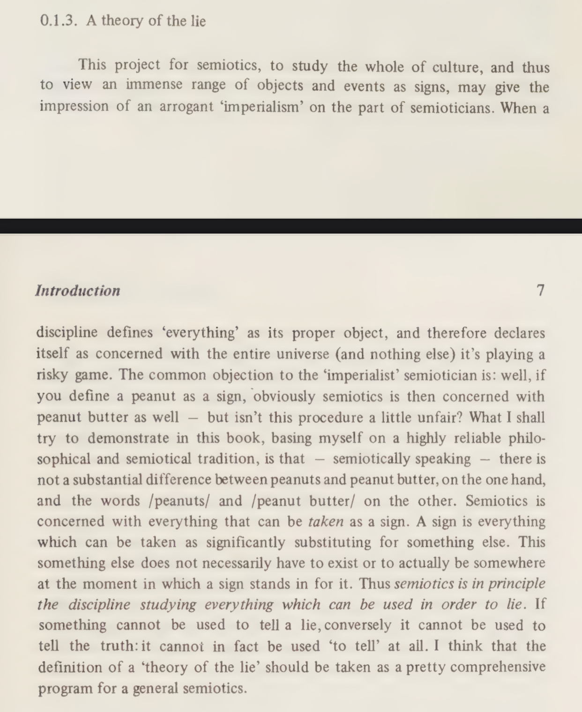
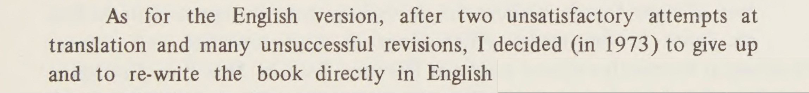

# A Theory of Semiotics

Umberto Eco

## 17 May 2025

Umberto Eco describes how the ability of the Australopithecus to use a rock to kill and then to see another rock and to have the idea of killing represents signification, but not communication; it is the same w/ the populist politicians and their followers. Their abilities end w/ identifying to kill. They are unable to engage in a constructive discourse. A Theory of Semiotics.

IMAGE

## 16 May 2025

## 15 May 2025

So, Umberto Eco writes a book in Italian. The English translation does not work, so he writes it in English. And while writing it in English he develops it so much, that he translates it back in Italian. A Theory of Semiotics. Foreword.

Of all intellectual pursuits, the three, that have always fascinated me, even before I understood what they are all about, are Law, Ethology and Semiotics.

* * *

* * *

* * *

