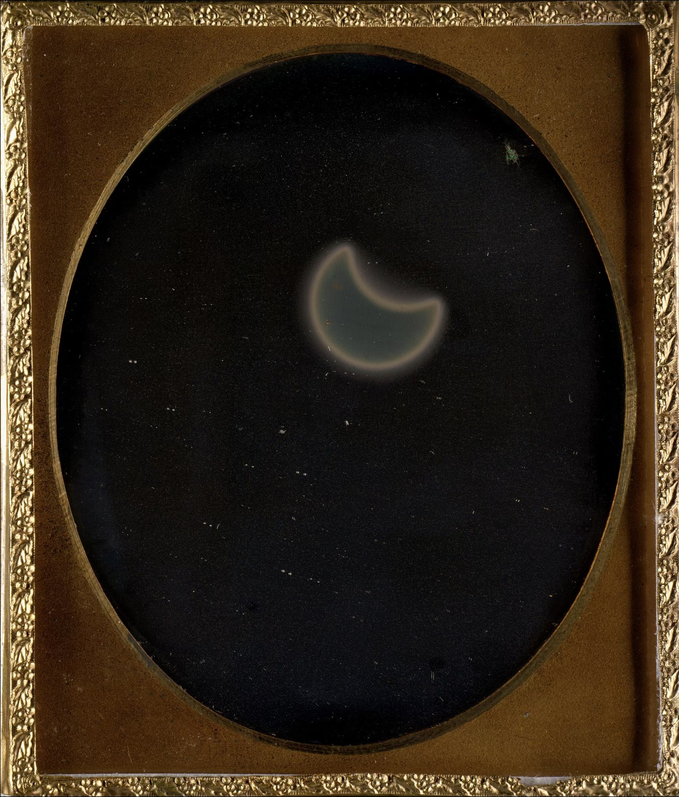

# Photography

Planar und Biotar [https://zeissikonveb.de/start/objektive/normalobjektive/biotar.html](https://zeissikonveb.de/start/objektive/normalobjektive/biotar.html)

[Martin Parr](../../../english/people/martin-parr/README.md)

## 1854

Frederick and William Langenheim: 'eclipse of the sun,' the first photograph of a solar eclipse.

