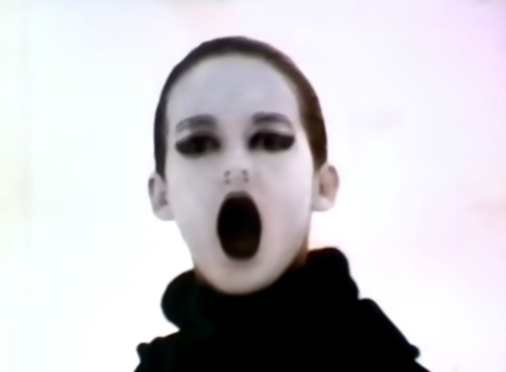
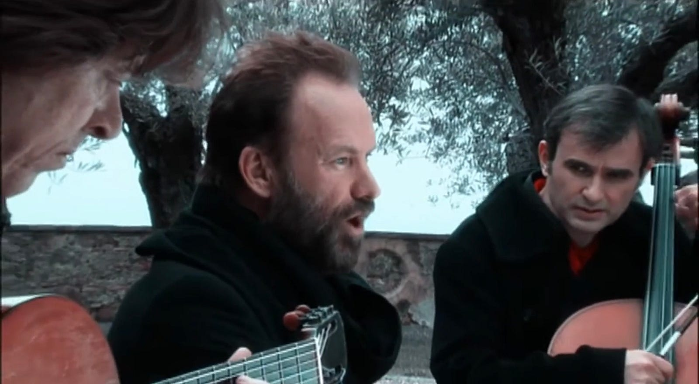
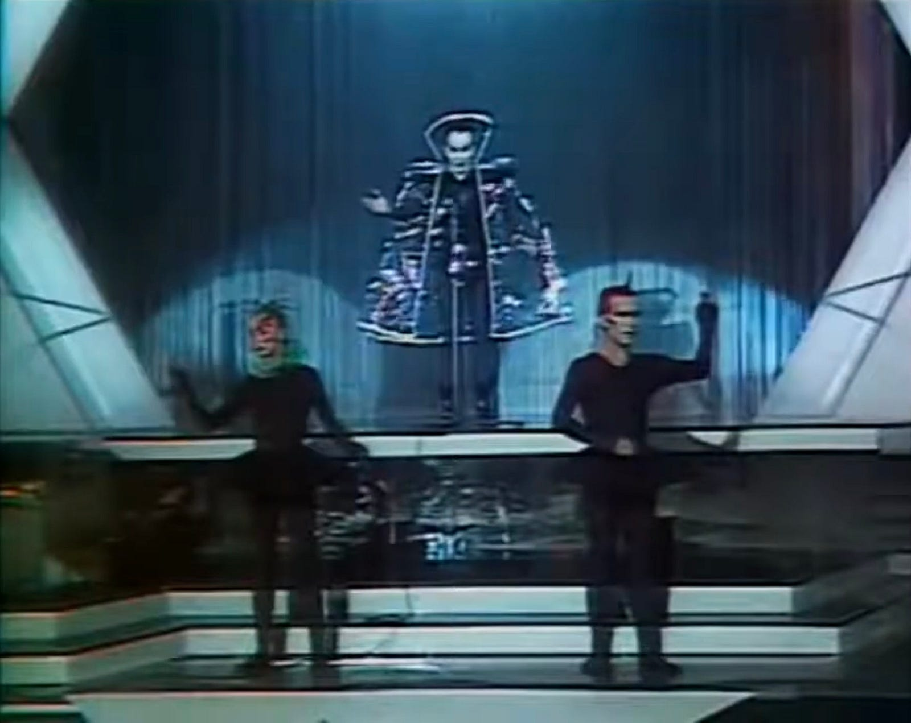
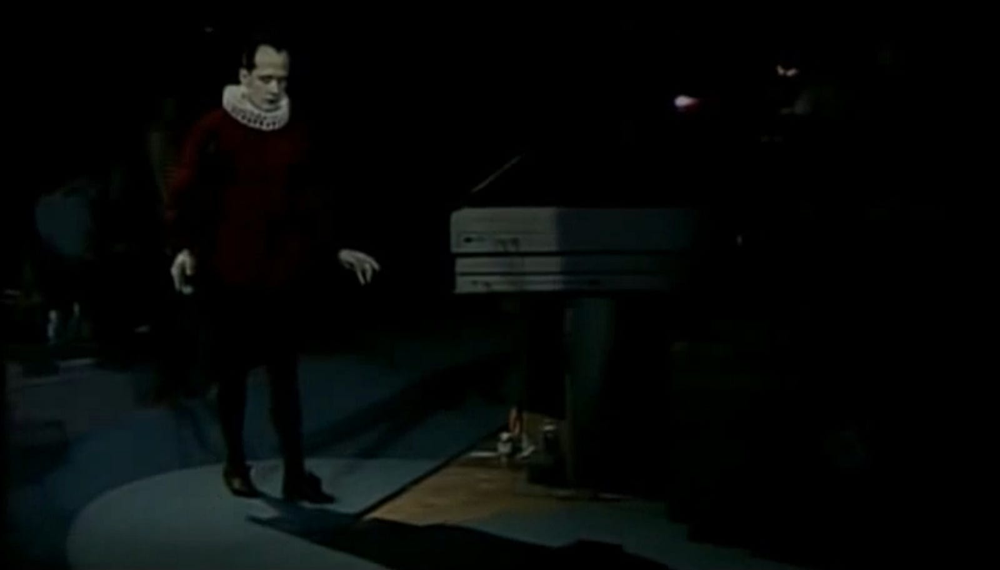
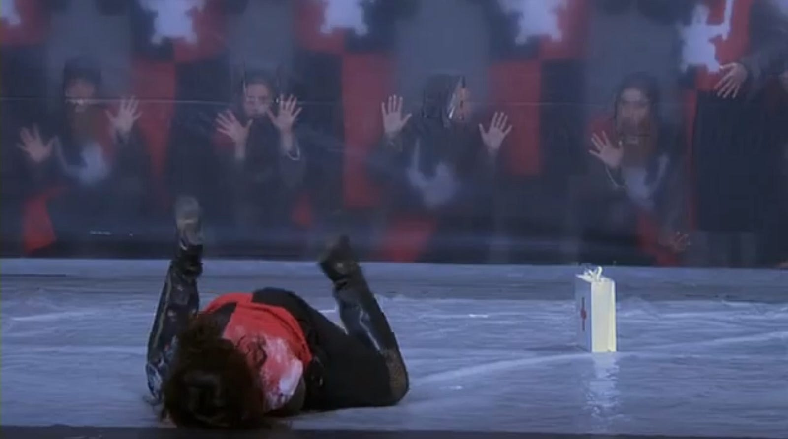
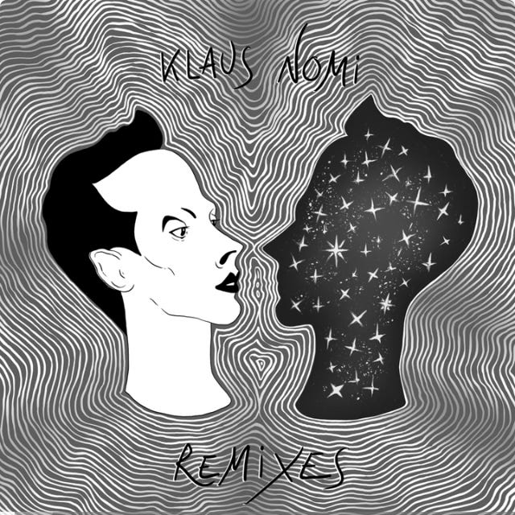
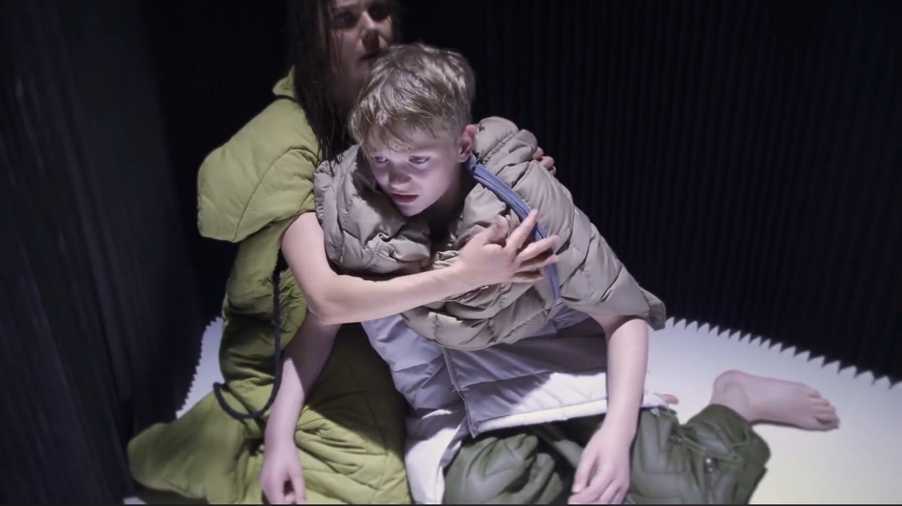

# The Cold Song

There is surprisingly little information about The Cold Song.

Based on the What Power Art Thou? aria from the 17th-century opera King Arthur by Henry Purcell it has some incredible contemporary interpretations.

Here are the three best according to me.

## #1 Nanette Scriba

In German.

See it on [YouTube](https://youtu.be/VnHnOHZmWDI?si=lgZtuEQbnYFOfVBZ).

## #2 Sting

Guitar, cello, voice.

See it on [YouTube](https://youtu.be/TNbKx2x3a9U?si=mNW1UD0zCS2NRIg1).

## #3 Klaus Nomi

A very Nomi.

See it on [YouTube](https://youtu.be/8wBWBfkuyvE?si=f_Qh0k8vmqRrWLyl).

w/ live orchestra

See it on [YouTube](https://youtu.be/c6-t1FFrpyM?si=E5vJQHRI3kAluHVr).

## Special Mentions

### A Comic One

See it on [YouTube](https://youtu.be/4CQ3u8y_GF8?si=wFAtQpfLcGQxgex3).

### Arnaud Rebotini remix of Klaus Nomi

See it on [YouTube](https://youtu.be/XrhlnpqiPP0?si=5ESAh9kH9QfBFcmL).

### Aksel Rykkvin

Brilliant.

See it on [YouTube](https://youtu.be/R12Zxvm128E?si=WFa-0jqrOq7Z-QiX).

### Neil Balfour

via my good friend Tom Garretson

See it on [YouTube](https://youtu.be/uwbFDoXpDZU?si=55a_WGxUY8HbFGJC).