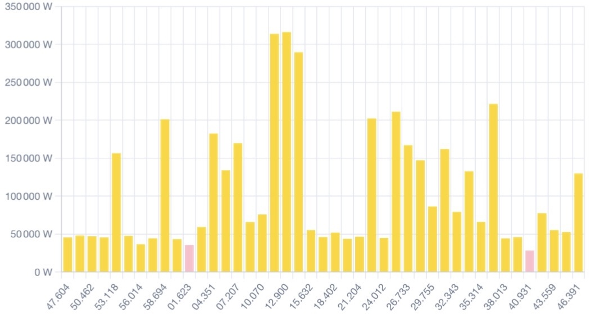

# Audience

This article is written for professionals in industrial organisations, who are responsible, formally or informally, for the purchase and use of energy.

These responsibilities may lie with different roles in different organisations.

Emerging aspects of these responsibilities may challenge and even overwhelm some of those professionals.

This article is especially aimed at them.

# Goal of this Article

Explain the different types of (electrical) peaks and peak management solutions.

# Sources

This article is loosely based on my *magnum opus* the handbook **How to Ask and Answer Qquestions related to Renewable Energy**.

The data and the charts are taken from an actual factory.

To write both I have implemented a number of peak management solutions in industrial context.

# No Association

Neither endorsement, nor fitness for purpose.

All examples are for illustration purposes only.

# Dictionary. Management vs Shaving

Peak Shaving is a colloquial name for Peak Management.

# Peak Management

Peak management, also called shaving, is the activity of managing electrical peaks.

# Reasons to Manage (Shave) Peaks

Electrical peaks may cross limits set by the grid operator, limits of fuses/circuit breakers, and due to one or a combination of those may additionaly hinder the operation of equipment, requiring prioritisation to be put in place.

## Grid Limits

Grid operators may impose limits.

These limits are typically two kinds: kW peak and kWh over a period of time.

## Peak Power Limit, kW Peak

The kW peak limit prohibits consumption above the limit even for a short time. Exceeding the kW peak limit may lead to circuit breakers opening to protect the grid. The factory loses grid power. Additionally there could be penalties.

## Energy Limit, kWh Over Period of Time

The energy limit for our factory is calculated the following way. The factory has an energy limit 398 kWh. The factory is not allowed to exceed 1/4 of it, or 99,5 kWh during any 15 minutes period.

## Grid Limits in Broader Context

The Grid Limits may be a bargaining chip in complex negotiations.

Our example factory can form an energy hub with a neighbouring factory in order to exchange excess electrical energy.

The grid operator is ready to allow that, but will then lower the limits of both companies. The lowered limits will fall under the minimum needs of the example factory to operate. This makes the hub possibility impossible to implement.

## Fuses/Circuit Breakers

Fuses and circuit breakers are another reason to manage (shave) peaks.

In another example a site has large water heaters, which consume more energy, than the fuses/ciruit breaksers can handle.

## Prioritisation

The limits on peaks may lead to the impossibility to operate equipment needed for the industrial processes.

The peak management in this case might require re-design of the industria process.

# Kinds of Peaks

In Industrial Context there are two major kinds of peaks.

## Fast Peaks

The Fast Peaks are caused by equipment such a cranes and welding equipment.

A crane may have 4 x 5 kW electrical motors to move and 2 x 50 kW electrical motors to lift, and can move and lift at the same time, therefore generating 120 kW at the push of a button.

## Slow Peaks

The Slow Peaks are caused by engaging equipment which stays in operation for longer periods of time. Like in the example above, where large water heaters must operate for several hours.

# Peak Management

In this section we will see how management of peaks is done. The approach to management of peaks depends on the reasons and on the overall goals.

## Strategies

Peak management requires a strategy.

The simples and most popular strategy is the curtailment of photovoltaic output. When the sun shines and all photovoltaic sites in a given area produce, the grid operator may limit the delivery to the grid. Since electricity is not like water and one cannot simply turn the valve. One needs to instruct the inverters to produce less electricity.

Depending on the source of peaks and on the reasons to manage them, different strategies can be developed.

## Implementations

The implementation of the strategy needs design of logic, an energy management software and a steering equipment.

## Logic

The logic can be simple or complex.

## Control Theory

An important fact about steering industrial equipment is that not infrequently has reaction time and reaction pattern.

Not infrequently, both must be taken into account.

For example, sending a steering command should be followed by a waiting time, which gives the system a chance to reach the desired state. Not doing that may lead to oversteering, or bringing the system to a state beyond the desired state.

Upon receiving a steering command the system may or may not reach the desired state. This can happen for a number of reasons, one of which is that it might not have the resources to do that or because it has a mind of its own and therefore follows additional rules.

All these factors are to be considered, when designing a peak management strategy.

## An Industrial Controller

In all cases, the management of the peaks involves an industrial controller, which is capable of communicating with the equipment involved in the management of the peaks.

## Energy Management Software

The controller runs energy management software, which implements the strategy by applying rules via steering commands sent to the equipment involved in the management of the peaks.

Prior to this, the controller conducts measurements, which form the basis of the decisions the controller makes and of the commands the controller sends.

## Emergency Control

When one manages (shaves) peaks with the help of, for example, batteries, one needs emergency control over the load, which is causing the peaks.

The reason for this is that the batteries may discharge before the end of the peak interval ends, which might lead to damage caused by the unsupported peak load.

To prevent such a damage the controller must be able to terminate the load-causing equipment. This may be possible or impossible, in which case the controller must be able to raise an alarm.

Termination of load causing equipemnt can be done with direct control, in cases where the equipment supports it. Or with a simple relay that simply interrupts the power supply that equipment. A brutal, but effective in some cases way.

## Managing vs Not Managing

Related to the Peak Limit vs Limit over Time.

## Management of Fast Peaks. Kinetic Solutions

Teraloop.

# Questions?

If you have any questions, please feel free to contact the authors of this article.

# Meet the Author

At SPS in Nürnberg in October.
