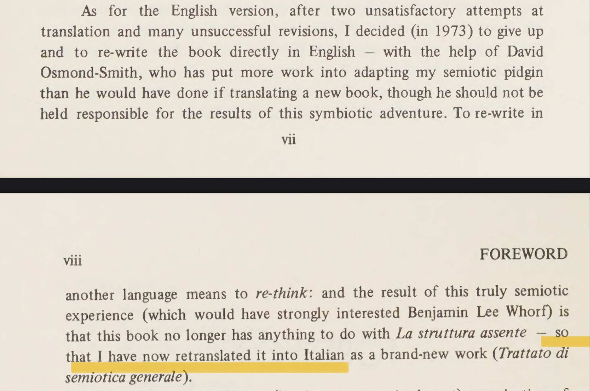
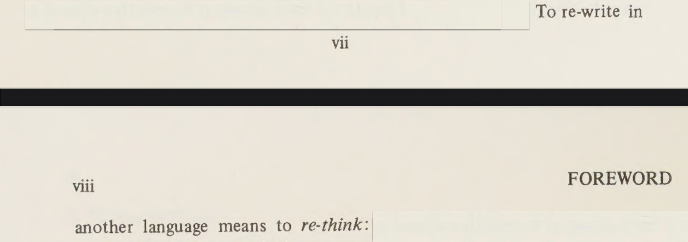
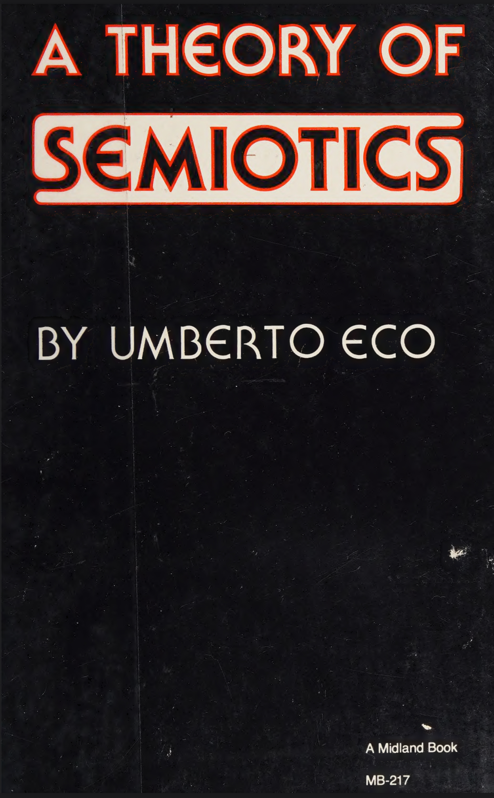

# A Theory of Semiotics

Umberto Eco

## 16 May 2025

## 15 May 2025

So, Umberto Eco writes a book in Italian. The English translation does not work, so he writes it in English. And while writing it in English he develops it so much, that he translates it back in Italian. A Theory of Semiotics. Foreword.

Of all intellectual pursuits, the three, that have always fascinated me, even before I understood what they are all about, are Law, Ethology and Semiotics.

* * *

* * *

* * *

