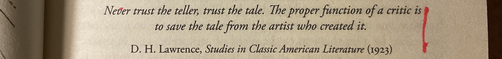
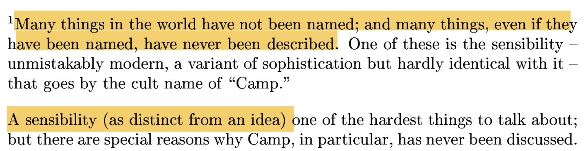

# The Morale of the Artists

_or how to be an artist and an audience in a world, that oscilates from "hosanna" to "crucify him"?_

_or what is the humanist version of "the ones, who are without sin among you, let them first cast a stone"?_

## How it all Began

When I was young, I loved Antoine de Saint-Exupéry.

Until one day I read, that he had been unfaithful to his wife.

This was during my pre-sex age. I had little idea of sex, sexual drive and infidelity. I had not been religeously or socially indoctrinated. It felt wrong in the context of the strive for justice children have.

## D H Lawrence

The question stayed w/ me for years until I read this quote in Frances Wilson's Burning Man: The Ascent of DH Lawrence.

This offered a perspective. I do not know if the perspective is right. But it offers an avenue towards a humanist version of "the ones, who are without sin among you, let them first cast a stone".

## Growing Sensibilities

Uncle Tom's Cabin has had a profound effect on attitudes toward African Americans and slavery in the United States and is said to have "helped lay the groundwork for the American Civil War" [[Wikipedia](https://en.wikipedia.org/wiki/Uncle_Tom%27s_Cabin)].

Yet, later, the book has been profoundly criticised [[Wikipedia](https://en.wikipedia.org/wiki/Uncle_Tom%27s_Cabin#20th_century_and_modern_criticism)].

In the introduction to her 1964 essay Notes on "Camp", Susan Sontag shows how sensibilities grow.

## The Continuous Need of New Artists

Here we have an avenue towards the answer of our first question, how to be an artist and an audience in a world, that oscilates from "hosanna" to "crucify him".

The answer is v simple.

Both "Hosanna" and "crucify him (or nowadays, her, it, them)" are part of the job.

Part of the lifecycle of an artist.

Be prepared to live it.

And that's why we constantly need new artists

The thought of new artists bothered me, when I was young. "There are so many good books", I thought. "Why do we need new?" For a period in my life I considered new artists a constant nuisance.

But then I evolved.

Even if in some area of life there is no new knowledge, there can ge new sensitivities, which we must incorporat4e, and new perspectives.

And we must ask new questions.

----

I am full of doubt and love discourse. If you feel like discussing, I am reachable under t.e.shaw@dahoum.wales.