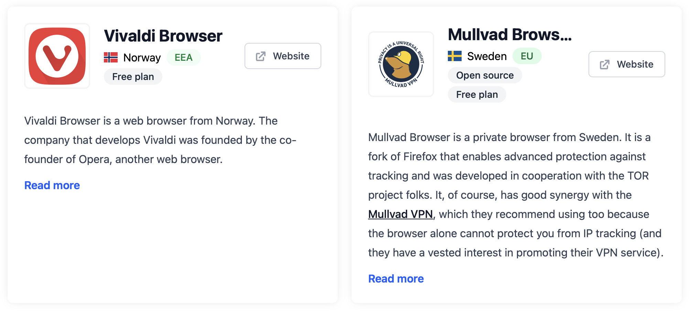

# What to do in this day and time and why?

What to do in this day and time and why?

An essay.

In my late teens and early 20s I was all Greenpeace and New Media Art (the Internet emerged when I was 23) and Revolution.

And lately I've been thinking, "What's wrong with the world and what's wrong w/ me?"

One thing that's wrong w/ the world is that it is beginning to feel v much how it felt prior to the French revolution: the rich get richer and the politics get shaped by the richer rich and the general population loses agency at a breathtaking pace.

And myself?

Comfortably sitting in the corporate ecosystem. No Greenpeace beyond a meager monthly donation, no New Media Art, no Revolution. 

So I decided to change.

Since guillotining people seems to be out of fashion and frowned upon, I had to think of other ways.

Top-down change has always had a limited success and has never had a success w/o a broad grassroots support. One can vote for politicians and end up, like us in Germany, w/ a BlackRock lobbyist as a Chancellor.

My idea of democracy is slightly different.

So, I decided to change myself.

First I quit my successful, but big corporations serving business, sold my shares and joined a small, but v advanced renewable energy project serving small and medium size businesses.

Second I founded a publishing house, which publishes the thoughts of ordinary, but interesting people. In two weeks we are going to the Frankfurt Book Fair w/ three titles.

Third, I started a project to help small and medium size businesses improve their Accounts Receivable by improving the overall relationship between the parties.

Then I did a few more things w/ which I am not going to bore you.

And then I turned my attention to my computing habits.

Apple, earlier a Revolution, has lately became a big fat corporate. Not evil looking, but big fat corporate nevertheless.

The integration is amazing. Everything is everywhere.

But that's how one cooks a frog, as the tale tells.

So I decided to change.

Today one can completely leave the big corporations and have the same experience by supporting smaller businesses.

There are independent and European —

— web browsers (image, I do love the Nordics)
— e-mail/calendar/etc.
— video conferencing
— cloud (files, office applications, etc.)

Check https://european-alternatives.eu

Hardware and operating systems is a bit more difficult, but there is the Dutch Fairphone and the French replacement of Google for Android by Murena.

At what cost am I doing this change and why?

The cost is a slight loss of convenience, but it is a much lower cost than having to go to the barricades.

And why?

Because the power is w/ the people and empowering the individual and the small and medium size businesses brings the power closer to where it belongs.

Big corporates might have brought good things, but they are more often than not the proverbial cheap gifts which Europeans gave to the local people, during the colonial times, in order to take their gold and land and natural resources and eventually, their lives.

A word from a very rich person in the ear of a politician can change the course of a country.

And that's wrong.

For the same reason mass media owned by the super rich is wrong. Media strategies can be subtle, long term and far reaching. Media should be independently owned, independently run and there should be many different voices.

So, I think, those, who want to avoid the barricades, can think of changing their habits a little bit and pay w/ a little discomfort.

It is much cheaper.

Change their life and habits, so that their actions support their fellow humans, their communities, and social societies and social ideas all over the world, instead of pouring more oil into the hell fire of the super rich w/ which they will burn the world to the ground.

Such tiny personal change is much cheaper, than having to go to the barricades.

And to those, who believe in trickle down economy I will say this. It trickles down only as much, as it is necessary, in order to maximise the riches of the super rich. There are armies of well educated people, supported by machines, who continuously work to make this happen.

And to those, who say, but if we do not treat the super rich nicely, they will leave I say this. Let them leave. They will leave and take w/ them their undemocratic toxicity and will free space for the smaller things to grow and prosper.

And to those, who say, "but this or that person donates a lot". Well, yes, but to whatever they think is good and at the cost of unchecked power and influence. If the same money would have stayed w/ the broader population, the world would have been a much better place. There are great projects funded by grassroots donations.

And to those who say, "but the super rich earned their riches with hard work" I will laugh in the face.

And to those who say, "but economy of scale" I will answer w/ this sentence from Margin Call, "Well, may be some of those people did not want to get there faster?"

And to those who, "Is this Marxism? Is this socialism? Is this communism? Communism did not work!" I say — no. It is a continuously self-balancing humanity, which seeks democratic, pluralistic society, life in peace, in which the individual has agency and is not terrorised by people far and away on topics, which concern mostly or only this person and nobody else.

Now. Ditch this big corporate web browser of yours and join the Revolution.