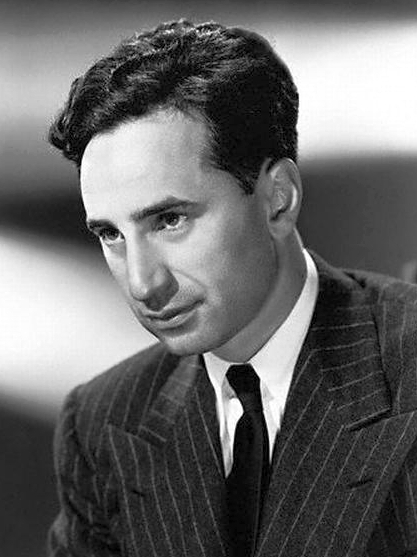

# Foreigners

Foreigners change their adopted countries and the world.

## Tom Stoppard

Born in Czechoslovakia, Stoppard left as a child refugee, fleeing imminent Nazi occupation. He settled with his family in Britain after the war. His work covers the themes of human rights, censorship, and political freedom, often delving into the deeper philosophical bases of society. Stoppard is one of the most internationally performed dramatists of his generation.

## Elia Kazan

"Elia Kazan, the immigrant child of a Greek rug merchant who
became one of the most honored and influential directors in
Broadway and Hollywood history..." [[Source](https://www.nytimes.com/2003/09/28/obituaries/elia-kazan-influential-director-dies-at-94.html)]

## Pedro Pascal

When Pedro Pascal was 9 months old his parents emigrated to the United States of America from Chilie via Venezuela and Denmark in order to escape the military dictatorship of General Augusto Pinochet, who was supported by -- surprise, surprise -- the United States of America.

Listen to Pedro Pascal telling his story on [Facebook](https://www.facebook.com/reel/1242204540899981?fs=e&fs=e)
