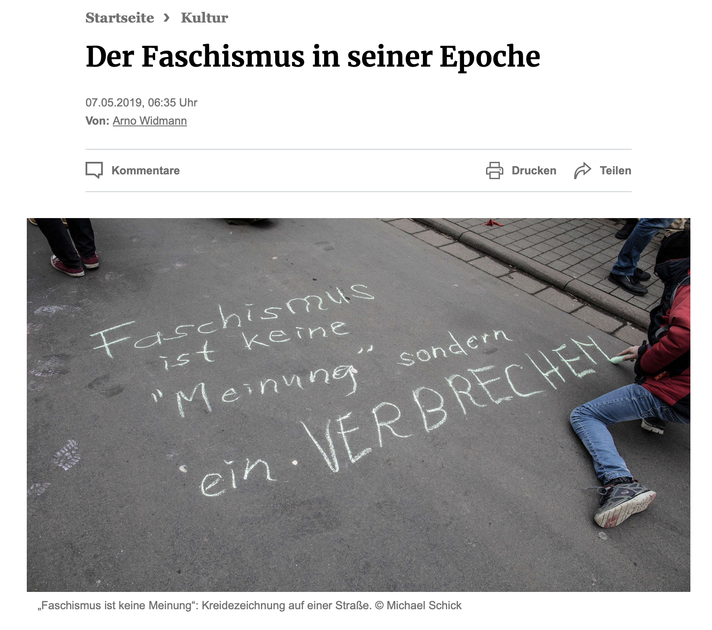
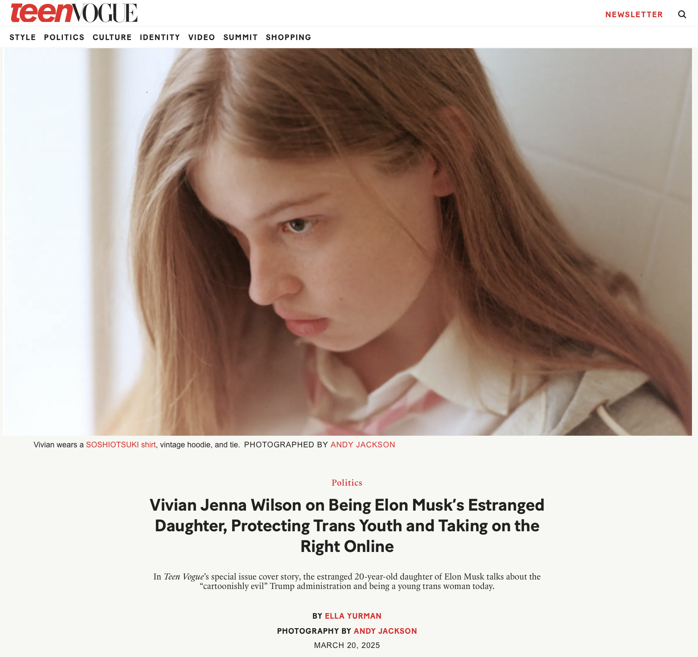
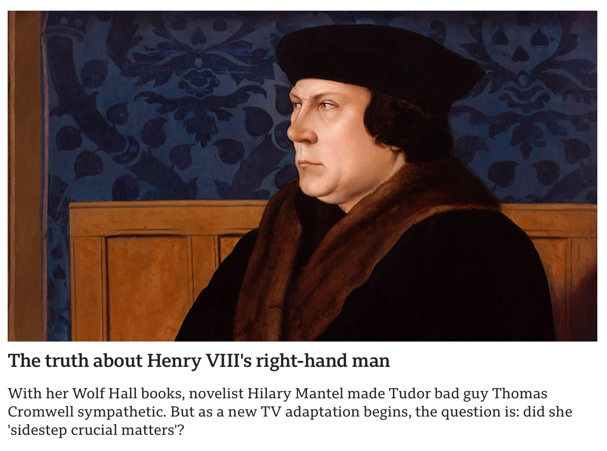

# Review of the Press

## 4 May 2025

"Faschismus war keine italienische Besonderheit, und der Nationalsozialismus war keine deutsche. Sie waren Teile einer weltweiten Bewegung, die Demokratie und rechtsstaatliche Institutionen beiseite fegte, um starken Männern ein möglichst unbehindertes Regiment zu ermöglichen. Die Idee von Checks and Balances, die Vorstellung, dass Macht kontrolliert werden müsse, wurde diskreditiert."

[https://www.fr.de/kultur/deutsche-geschichte-faschismus-seiner-epoche-12251270.html](https://www.fr.de/kultur/deutsche-geschichte-faschismus-seiner-epoche-12251270.html)

## 24 March 2025

[https://edition.cnn.com/2025/03/24/politics/trump-bondi-elite-universities-boasberg-judges-deportation/index.html](https://edition.cnn.com/2025/03/24/politics/trump-bondi-elite-universities-boasberg-judges-deportation/index.html)

## 22 March 2025

### Vivian Jenna Wilson on Being Elon Musk’s Estranged Daughter, Protecting Trans Youth and Taking on the Right Online

[https://www.teenvogue.com/story/vivian-jenna-wilson-elon-musk-trans-youth](https://www.teenvogue.com/story/vivian-jenna-wilson-elon-musk-trans-youth)

## 21 March 2025

### Rags-to-riches hero or villainous torturer? The truth about Henry VIII's scheming right-hand man Thomas Cromwell

[https://www.bbc.com/culture/article/20250320-the-truth-about-henry-viiis-scheming-right-hand-man-thomas-cromwell](https://www.bbc.com/culture/article/20250320-the-truth-about-henry-viiis-scheming-right-hand-man-thomas-cromwell)

